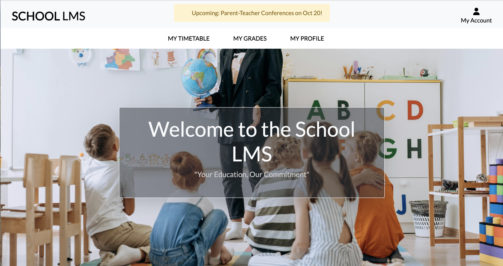
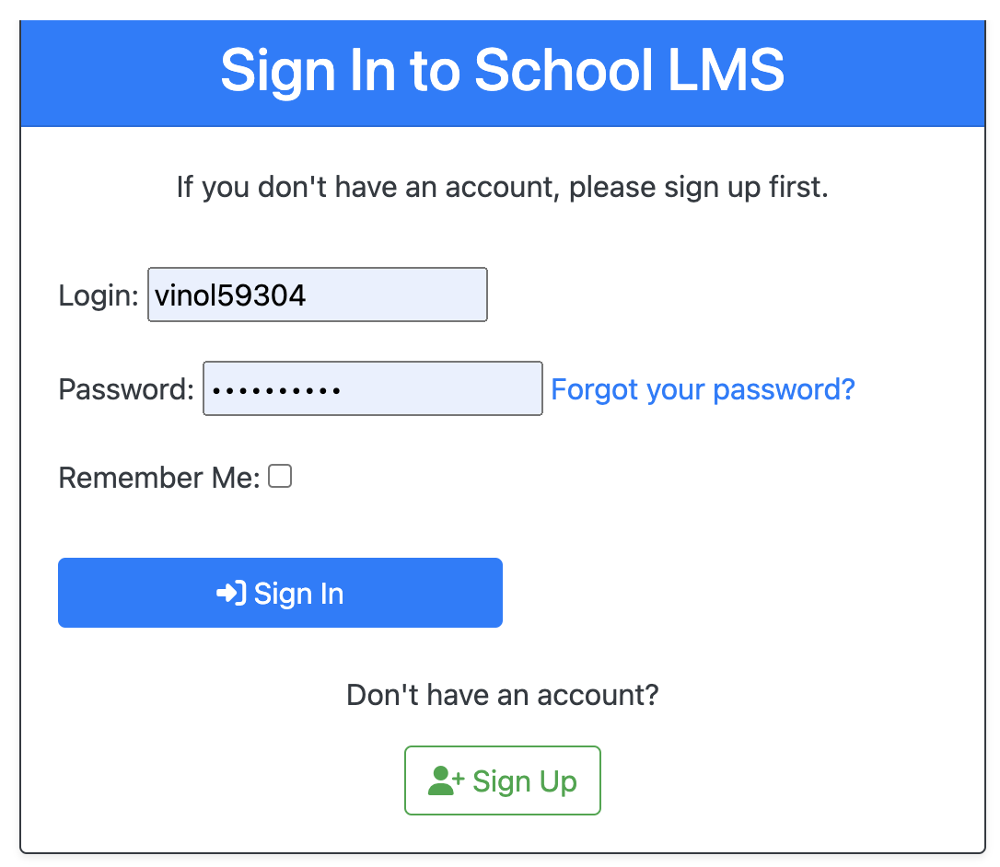
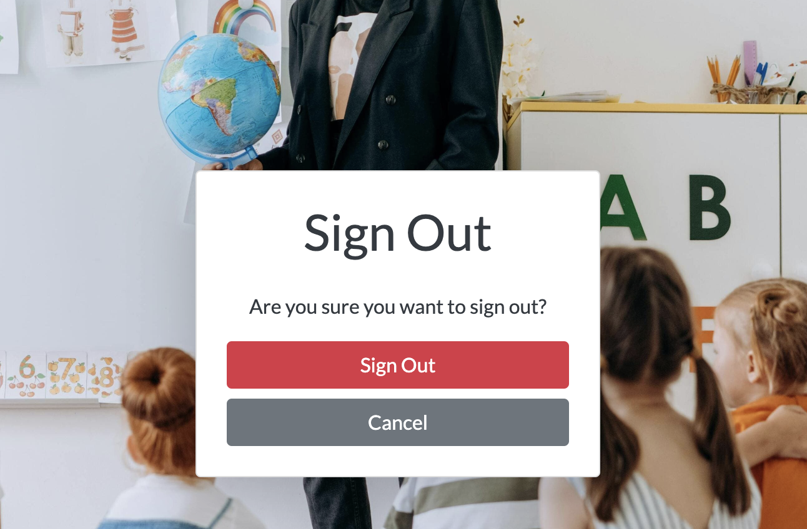
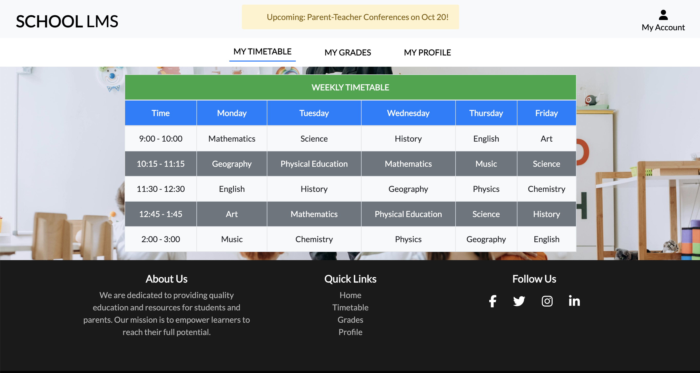
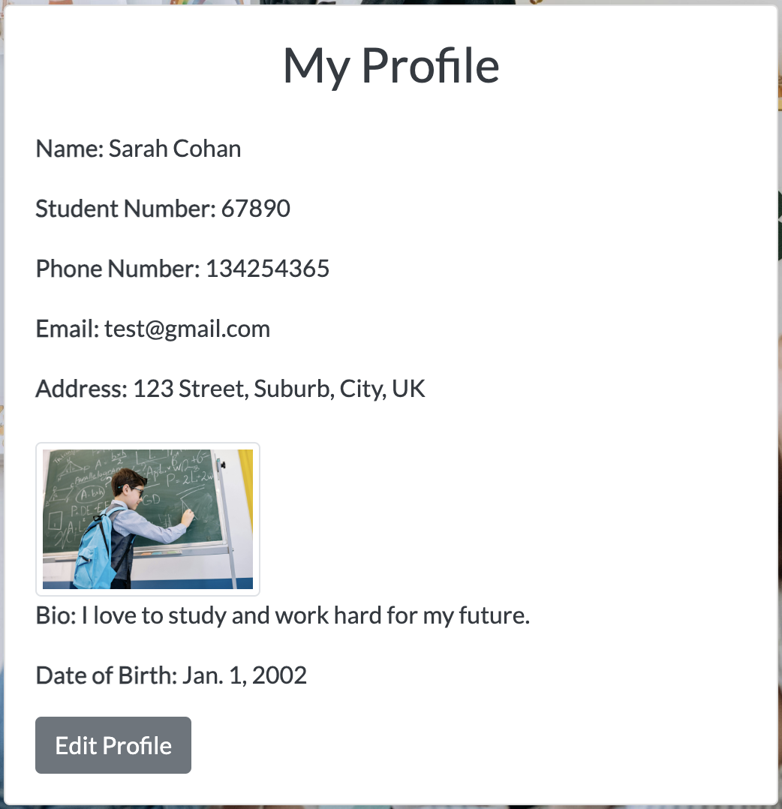

# School Learning Management System

#### By Lauren Pechey

[Click here to view the live web application](https://school-lms-project-06a6aa171a7b.herokuapp.com/)

This is the documentation for a School Learning Management System (LMS) built as an Individual project for the Secure Software Development module at the University of Essex Online. It has been built using Django, Python, BootStrap, CSS3 & HTML5.

## Planning, Design & User Experience

I approached the planning & design of this project using the principles of User Experience, which include the 5 stages of strategy, scope, structure, skeleton & surface. This project has many important security considerations so it was important to make sure it remained on course, on time and the the best it could be whilst meeting all of the criteria for the MVP (Most Viable Product). 

### Project Aims

The main purpose of the project was to create a simple School LMS website, which allows parents, students and admin to view their timetables, grades and profiles through the site. The project was based off the initial group design document which also took security measures into consideration. 

## Skeleton

### Wireframes

#### Wireframes (see below)

Wireframes were developed using [Figma](https://www.figma.com/), including making all colour, typography and layout decisions at this stage. This was done to ensure that the focus would be on building the site, rather than designing it.

### Models

The site uses a relational database model using Postgres [NeonTech](https://neon.tech/). The app uses a number of models: User, StudentProfile, UploadedFile, Grade, Timetable, and Email. The User model is created by Django allauth and connects to a separate Email Address Model. 

#### Typography

The website uses 2 typefaces that I felt worked well together and complemented each other:
- Open Sans for headings, paragraphs & the site logo.
- Sans Serif as the default backup font.

## Features

This section shows details of all features on the site including details of their value to the user.

### Home Page

- All pages have title & description meta tags to improve their SEO performance. 

### Authentication Pages

- The project uses AllAuth to implement User login and authentication functionality. AllAuth comes with a whole load of backend functionality and front end templates that make the user, registration, sign in/out and user management easy and quick to create.
- AllAuth provides a series of templates for all the actions required to implement authentication. The site uses these with its own bespoke styling to make them feel part of the site.
- All the form have been styled using the [widget-tweak](https://pypi.org/project/django-widget-tweaks/) package to add styling classes to inputs, labels and error messages from within the form templates

**Value to User**

A strong authentication system is vital to a school LMS, allowing users to log in, register, manage their profile, see their grades and timetables and store their data for the next time they want to visit the site. It improves user experience and make the process of visiting the site quicker and smoother. The styling of the forms matches the rest of site making it feel like it belongs and building confidence and trust in the site.

### Grades Page

### Timetable Page

### Profile Page

- The User Profile gives users a way to store their information and site actions
- It connects them to their personal information
- The profile page gives them access to viewing, updating and amending this information in a single location
- The page is only visible to logged in users and users can only view their own information, not that of other users

**Value to User**

The profile page gives users a single point to access all of their information. It allows them to update their information without having to search around the site for them. It provides a quick, efficient way to manage their data.

### Future Features

There are a number of features that could be implemented in the future, particularly if it were adapted to a real live site for school LMS.

#### Admin Messaging System

It would benefit from a messaging system, giving the site admins the ability to reply directly from the site, to be able to view the historic chain of communication, to have multiple statuses for messages e.g. in-process, and to connect messaging to the user so that users could also reply from within the site rather than via email. 

It would also be useful to add notifications to both admins and users when they receive a message, with an icon appearing in the navbar to alert them.

## Technologies Used

### Languages

- [HTML:](https://en.wikipedia.org/wiki/HTML5) Used to build the main structure of the site
- [CSS:](https://en.wikipedia.org/wiki/Cascading_Style_Sheets) Used to style the website (Combination of bespoke styling and Bootstrap)
- [Python: ](<https://en.wikipedia.org/wiki/Python_(programming_language)>) Used to build the core of the backend of the project within the Django framework

### Frontend Frameworks / Libraries

- [Bootstrap:](https://getbootstrap.com/) Used throughout the site for the styling, layout & responsiveness
- [Font Awesome:](https://fontawesome.com/) Used to add icons to the site to help with UX and to add more character

### Backend Modules / Packages & Frameworks

- [Django:](https://www.djangoproject.com/) High Level Python-based Web Framework.
- [AllAuth:](https://django-allauth.readthedocs.io/en/latest/) Integrated Django authentication & sign in.
- [Django Storages:](https://django-storages.readthedocs.io/en/latest/) Collection of custom storage backends for Django
- [Gunicorn:](https://gunicorn.org/) A Python WSGI HTTP Server for UNIX
- [Pillow:](https://pypi.org/project/Pillow/) Python imaging Library for extended image handling capabilities
- [Psycopg2:](https://www.psycopg.org/) Postgres adaptor to allow smooth communication between the backend and the database
- [dj-database-url:](https://pypi.org/project/dj-database-url/) Allows you to use DATABASE_URL env variable in settings.py
decentralised identity system
- [sqlparse:](https://pypi.org/project/sqlparse/) SQL parser for Python
- [urllib3:](https://pypi.org/project/urllib3/) HTTP client for Python

### Databases 
- [SQLITE:](https://docs.djangoproject.com/en/4.1/ref/databases/#sqlite-notes) Used as the built in Django database for development
- [NeonTech PostgreSQL:](https://console.neon.tech/app/projects) Postgres-based database host. Used to host the database for the live production app.

### Other Tools

- [Git:](https://git-scm.com/) Used for version control via Code Anywhere by using the terminal to Git and Push to GitHub
- [GitHub:](https://github.com/) Used to store the project code
- [Gitpod:](https://www.gitpod.io/) Used to create, edit & preview the project's code
- [Heroku:](https://dashboard.heroku.com/apps) Used to deploy the live site
- [Cloudinary:](https://cloudinary.com) Used to host the static files and images for the live production site.
- [Google Chrome Dev Tools:](https://www.google.com/intl/en_uk/chrome/) Used to test and debug the production and live apps

### External Sites / Resources / Software

- [Figma:](https://www.figma.com/) Used to develop the wireframes in to a full site design including colours, fonts, proportions etc
- [Google Fonts:](https://fonts.google.com/) Used to select & import the fonts to the project (Oxygen & Source Sans 3)
- [Adobe Illustrator:](https://www.adobe.com/uk/products/illustrator.html) Used to create the site logo
- [Adobe Photoshop:](https://www.adobe.com/uk/products/photoshop.html) Used to crop, adjust and resize the photos to optimise them for the site
- [Bulk Photo Resize:](https://bulkresizephotos.com/en) Used to resize & convert images 
- [Tiny PNG:](https://tinypng.com/) Used to further optimise the images for the site and reduce file size
- [Favicon.io:](https://favicon.io/favicon-converter/) Used to create and add the favicon to the browser tab
- [Google Chrome Dev Tools:](https://developers.google.com/web/tools/chrome-devtools) Used to inspect page elements, debug issues with the site & test responsiveness on different mockup devices
- [Temp Mail:](https://temp-mail.org/en/) Temporary email generator for testing account verification & order confirmation

## Deployment

### Forking the GitHub Repository

Forking the GitHub repository allows you to create a duplicate repository in order to make changes without affecting the original.

1. Log in to GitHub and go to the GitHub repository
2. Click on Fork (top right) to fork the repository
3. Give the fork a name and description if you wish and click "Create Fork"
4. You can now open the repository in your IDE of choice e.g. GitPod
5. Once in your IDE you can install the project requirements from the requirements.txt file using the command `pip3 install -r requirements.txt`

### Making a Local Clone

A local clone allows you to create a copy of the project to work on locally on your own computer in your code editor of choice (e.g. VS Code)

1. Log in to GitHub and go to the GitHub Repository
2. Click on "Code"
3. To clone using HTTPS copy the provided link on the HTTPS tab
4. Open your own terminal for your coding environment (making sure you have Git installed)
5. Set your current directory to the location you want to store your new clone
6. Type `git clone`, followed by the copied link you copied from GitHub
7. Press Enter to create your local clone of the project
8. Set up your local development environment
9. Install the project requirements from the requirements.txt file in the project using the command `pip3 install -r requirements.txt`
10. Create your own env.py file containing all the required environment variables
11. You are now ready to start working on your own clone of the project - enjoy!

For more details and information go to GitHub's useful guide to [cloning repositories](https://docs.github.com/en/repositories/creating-and-managing-repositories/cloning-a-repository#cloning-a-repository-to-github-desktop)

### Deploying Your App

Deployment allows you to transfer your project from your local environment or IDE to hosting it publicly for other people to view and enjoy. There are certain steps you will need to take to do this and they are detailed below. **These instructions are based on using an IDE like GitPod and having followed the instructions for Forking the repository above, especially installing the requirements.** For users wishing to deploy from a local clone different steps may be required which will depend on your local development environment.

#### Setting up a Database

When working on the app in GitPod a local database (sqlite) is used which will not be available on the deployed app. You will need to set up a separate database for the deployed site.

1. Go to [NeonTech](https://www.neontech.com/) and click on 'get a managed database'
2. Sign in using your GitHub account & authorise NeonTech to access your GitHub account
4. Set up a team and go through the login credential process or log in if you already have an account
5. Once you are logged in name your plan (usually the project name)
6. Select your nearest region
7. Click on 'create database'

#### Deploying to Heroku

1. Create a Procfile in your app in the root directory with the following content `web: gunicorn school-lms-project.wsgi:application` and a blank line at the end.
2. Log in to Heroku using the GitPod terminal using the command `Heroku login`` and enter your Heroku email and password
  - if you have 2 factor authentication set up you will need to use `Heroku login -i` followed by your email and your Heroku API key as the password which you can find in your account settings on Heroku
4. Temporarily disable Heroku from collecting static files during deployment using the command `heroku config:set DISABLE_COLLECTSTATIC=1 --app heroku-app-name`
5. Commit your changes to GitHub using `git add .`, `git commit` & `git push` in the terminal
6. Then to deploy your site to Heroku use the command `git push Heroku main`
7. Your site will now be deployed without any of the static files (CSS, JavaScript & Media files)

### Content

#### Images

- [Home Cover image](https://images.pexels.com/photos/3184328/pexels-photo-3184328.jpeg)

### Acknowledgments

* My tutor Anupam for all of his help and advice throughout the project.
* The whole team at [University of Essex Online](https://online.essex.ac.uk/) for their teaching and support.

